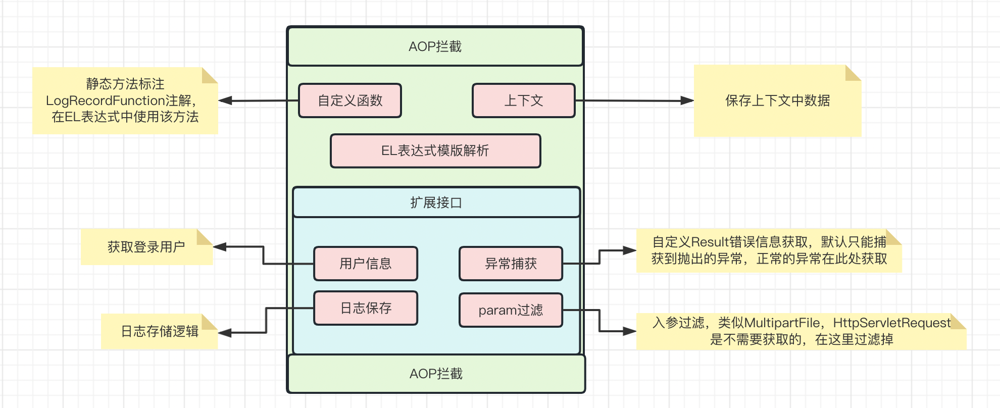

## 操作日志


此版本操作日志主要就是通过AOP拦截器实现的，整体主要分为AOP拦截器、自定义函数、日志上下文、扩展接口；组件提供了6个扩展点，自定义函数、日志上下文、用户信息获取，日志保存，自定义异常获取，入参过滤，业务可以根据自己的业务特性定制符合自己业务的逻辑。

#### 1. 注解

| 注解                 | 含义               |
| -------------------- | ------------------ |
| @LogRecordFunction   | SpEL自定义函数扩展 |
| @LogRecordAnnotation | 记录操作日志       |

#### 2. @LogRecordAnnotation（声明记录操作日志）

| 字段    | 是否必填 | 含义                                                         | EL表达式 |
| ------- | -------- | ------------------------------------------------------------ | -------- |
| bizCode | 是       | 业务编码                                                     | 是       |
| msg     | 是       | 日志描述                                                     | 是       |
| result  | 否       | 操作结果，默认【成功/(失败:errMsg)】，填写后(成功)替换为(填写值) | 是       |
| fileId  | 否       | 文件ID，可配置在注解上或者配置到上下文中                     | 是       |
| bizId   | 否       | 批次ID，可配置在注解上或者配置到上下文中                     | 是       |
| param   | 否       | 操作说明，默认为入参，填写后为(填写值)+入参                  | 是       |
| extra   | 否       | 任意值                                                       | 是       |

#### 3. @LogRecordFunction（声明SpEL自定义函数）

| 字段  | 是否必填 | 含义     |
| ----- | -------- | -------- |
| value | 否       | 函数名称 |

**函数名称示例**

| 类@LogRecordFunction | 方法@LogRecordFunction | 函数名称       |
| -------------------- | ---------------------- | -------------- |
| value="class"        | value="method"         | class_method   |
| value=""             | value="method"         | method         |
| value="class"        | value=""               | class_方法名称 |
| value=""             | value=""               | 方法名称       |

#### 4. LogRecordContext，操作日志上下文

例如文件ID，操作ID有些时候，入参不方便获取，可以在方法中放入日志上下文中。

```java
/**
 * 文件ID
 */
public static final String CONTEXT_KEY_NAME_FILE_ID = "fileId";
/**
 * 批次ID
 */
public static final String CONTEXT_KEY_NAME_BATCH_ID = "batchId";
```

```java
LogRecordContext.putVariable(LogRecordContext.CONTEXT_KEY_NAME_FILE_ID,"123")
```

#### 5. IOperatorGetService，扩展接口

```java
public interface IOperatorGetService {

    /**
     * 获取登录用户
     *
     * @return 用户
     */
    Object getUser();

    /**
     * 后续处理日志记录
     *
     * @param logRecordDTO 日志记录实体
     */
    void insertLogRecord(LogRecordDTO logRecordDTO);

    /**
     * 自定义通知返回值错误信息解析
     *
     * @param result result
     * @return errMsg
     */
    String customResponseError(Object result);

    /**
     * 入参过滤
     * @param args 方法参数列表
     *
     * @return 入参过滤
     */
    String paramFilter(Object[] args);

}
```

#### 6. QuickStart

**项目Maven地址**

```xml
<dependency>
  <groupId>io.github.moyifengxue</groupId>
  <artifactId>log-record-spring-boot-starter</artifactId>
  <version>1.0.0</version>
</dependency>
```

**GitHub地址**

https://github.com/moyifengxue/log-record-spring-boot-starter

**QuickStart**

项目支持SpringBoot2.x以及升级后的SpringBoot3.x开箱即用，因为只是一个简单的AOP拦截器，目前无需再配置文件配置数据。

但是用户需要自己实现IOperatorGetService扩展接口，将其实现类注入到Spring容器中即可。

##### 6.1 getUser()：

一般直接返回用户项目中上下文中的用户信息即可。

##### 6.2 insertLogRecord(LogRecordDTO logRecordDTO)：

入参为logRecordDTO，即AOP拦截器获取到的数据，实现此接口进行自定义的数据存储。

##### 6.3 customResponseError，paramFilter

此两个方法只是对result数据和param参数做一定的处理。

